  <a href="https://l4b.dev">
     l4b_ — build · break · repeat" width="100%">
  </a>

  <b>Prototypes, side projects and maker experiments — built after hours, just for fun.</b>

---

### 👋 What is l4b?

l4b is a small crew of tinkerers. We use this org as a shared workbench for the things we build in our free time: quick prototypes, half-baked ideas that turned out to be fun, hardware hacks, and the occasional project that actually gets finished.

Expect rough edges. That's part of the fun.

### 🔧 What you'll find here

| Area | What's in it |
| --- | --- |
| **Prototypes** | Quick experiments to answer "could this work?" |
| **Dev tools** | Small utilities and scripts we built because we needed them |
| **Maker stuff** | Firmware, electronics and 3D-printing projects |

<!---
### ⭐ Featured projects

| Project | What it does |
| --- | --- |
| [**[PROJECT-NAME]**](https://github.com/[ORG]/[REPO]) | [One line about it] |
| [**[PROJECT-NAME]**](https://github.com/[ORG]/[REPO]) | [One line about it] |
| [**[PROJECT-NAME]**](https://github.com/[ORG]/[REPO]) | [One line about it] |
-->

### 🤝 Say hi

Found something useful, broke something, or have an idea? Open an issue on the repo in question. We're happy to hear from you.

  <a href="https://l4b.dev">l4b.dev</a>

